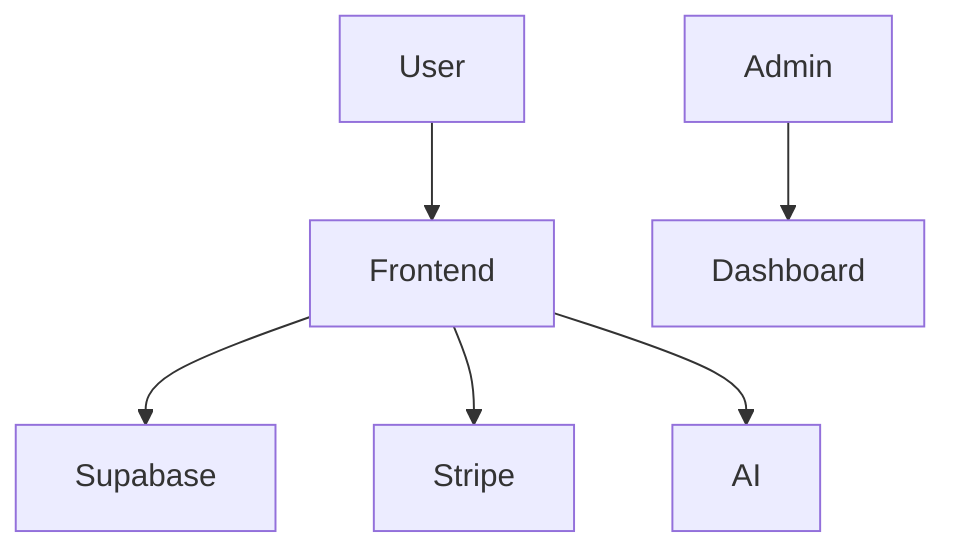

# 🌍 SHAPEthiopia

### Sustainable Hope for Africa Program Ethiopia

<p align="center">
  
</p>

<p align="center">
  
  
  
  
</p>

## 🎨 Project Banner

<p align="center">
  
</p>

## ✨ Overview

**SHAPEthiopia** is a full-stack humanitarian platform designed to support and empower communities across Ethiopia through technology-driven solutions.

### 🎯 Mission

To create sustainable social impact by connecting donors, volunteers, and communities through a smart digital platform.

---

## 🚀 Key Features

### 👤 User Side

* 🔐 Secure Authentication (Email + Google OAuth)
* 💳 Multi-payment Donations

  * Stripe (International)
  * Telebirr & CBE (Local)
* 📊 Personal Dashboard
* 🧾 Donation History Tracking
* 🙋 Volunteer Application System

---

### 🛠 Admin Dashboard

* 📈 Analytics & Reports
* 💰 Donation Approval System
* 👥 Volunteer Management
* 🔔 Notifications System
* 🔐 Role-Based Access Control (RBAC)

---

### 🤖 AI Integration

* 💬 AI Chat Assistant (OpenAI API)
* 📉 Donation Prediction Alerts
* ✍️ Smart Content Optimization


## 🧠 Tech Stack

### Frontend

* Next.js (App Router)
* React.js
* Tailwind CSS
* shadcn/ui

### Backend

* Node.js API Routes

### Database

* Supabase (PostgreSQL)

### Integrations

* Stripe (Payments)
* SendGrid (Emails)
* OpenAI (AI Assistant)

---

## 🏗 Architecture Overview



---

## 📂 Project Structure

```
shape-ethiopia/
├── app/
├── components/
├── lib/
├── api/
├── public/
└── styles/
```

---

## ⚙️ Getting Started

### 1. Clone Repository

```bash
git clone https://github.com/daveontrack/shapeeeeti.git
cd shapeeeeti
```

### 2. Install Dependencies

```bash
pnpm install
```

### 3. Environment Variables

Create `.env.local`:

```env
NEXT_PUBLIC_SUPABASE_URL=
NEXT_PUBLIC_SUPABASE_ANON_KEY=
STRIPE_SECRET_KEY=
SENDGRID_API_KEY=
OPENAI_API_KEY=
```

### 4. Run Development Server

```bash
pnpm dev
```

---

## 📊 Database Design

Main Tables:

* users
* donations
* volunteer_applications
* contacts
* newsletter_subscribers

---

## 📦 Deployment

* 🚀 Vercel (Recommended)
* 🌍 Custom domain supported

---

## 📈 GitHub Stats

<p align="center">
  
</p>

---

## 🔮 Future Improvements

* 📱 Mobile App (React Native)
* 🌍 Full Amharic UI Expansion
* 🤖 Advanced AI Analytics
* 💳 More Ethiopian Payment Integrations

---

## 👨‍💻 Author

**Dawit Mengesha Beriso**

* 🌐 https://dawitmengesha.netlify.app/
* 🐙 https://github.com/daveontrack

---

## 🤝 Contributing

```bash
fork → clone → code → commit → push → pull request
```

---

## ⭐ Support

If you like this project:

⭐ Star the repo
🔁 Share it
🤝 Contribute

---

## 📜 License

MIT License © 2026 SHAPEthiopia
